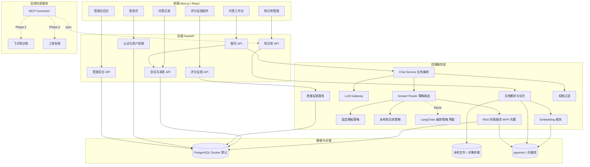
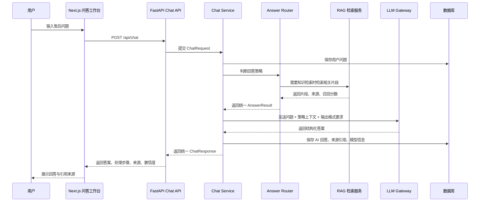
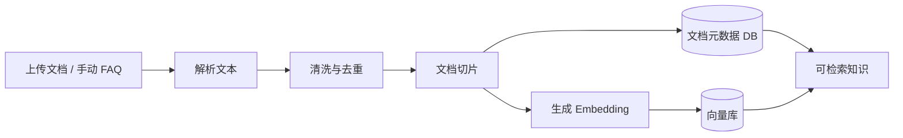
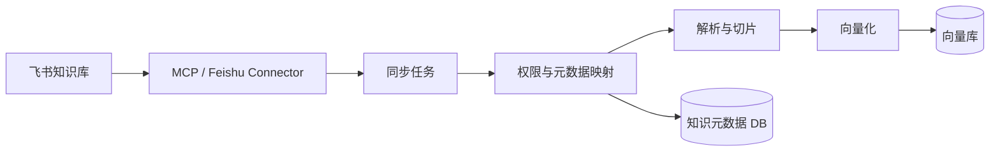
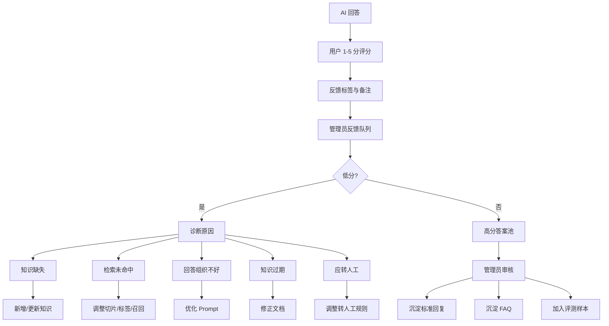
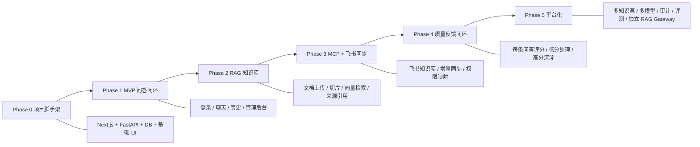

# AidBot MVP 架构演进图

> AidBot 是面向公司内部售后、客服、技术支持和产品支持人员的 AI 问答系统。第一版目标不是做复杂平台，而是完成“可登录、可提问、可追溯来源、可反馈评分、管理员可复盘”的最小闭环。

## 1. 项目定位

AidBot 第一阶段定位为内部售后问答工作台：

- 普通用户：提问、查看 AI 回答、查看引用来源、评分反馈、复制答案或转人工。
- 知识库管理员：上传知识、查看同步状态、处理低分反馈、沉淀高分答案。
- 系统管理员：管理用户、权限、模型配置、知识源配置和质量看板。

第一版不做外部客户门户、不做多租户 SaaS、不做复杂工作流审批。

## 2. MVP 总体架构图



存储决策：

- MVP 默认使用 Docker 启动 PostgreSQL，业务数据、会话、反馈、知识元数据和审计日志都进入 PostgreSQL。
- 向量检索优先采用 PostgreSQL + `pgvector`，便于 MVP 阶段减少独立组件数量；后续文档量、流量或召回调参需求上升时，再替换为独立向量库或独立 RAG Gateway。
- SQLite 只适合作为极早期本地 demo 备选，不作为当前 Docker 开发路径的默认存储方案。

问答编排决策：

- `/api/chat` 是稳定业务 API，不暴露固定模板、RAG、LangChain 或本地知识库等内部策略细节。
- `Chat Service` 负责会话、权限、调用策略、调用 LLM、保存消息和统一返回。
- `Answer Router` 负责选择回答策略：固定模板、RAG 向量检索、本地知识库，或未来 LangChain 编排。
- 每一种策略都必须输出统一的 `AnswerResult`，再由 `Chat Service` 转换成统一 `ChatResponse`。

## 3. 问答数据流



问答返回建议结构：

```json
{
  "answer": "...",
  "solution_steps": ["..."],
  "confidence": "low|medium|high",
  "sources": [
    {
      "title": "...",
      "source_type": "upload|feishu|manual|ticket",
      "doc_id": "...",
      "chunk_id": "...",
      "score": 0.82,
      "updated_at": "..."
    }
  ],
  "handoff_required": false,
  "handoff_reason": ""
}
```

策略输出统一结构：

```json
{
  "strategy": "template|rag|local_kb|langchain",
  "context": "...",
  "sources": [],
  "confidence": "low|medium|high",
  "handoff_required": false,
  "handoff_reason": ""
}
```

固定模板、RAG 向量库、本地知识库和未来 LangChain chain/agent 都不能直接改变 `/api/chat` 的外部响应合同；它们只能作为内部策略实现，最后统一收敛到 `AnswerResult` / `ChatResponse`。

## 4. 知识入库数据流

MVP 阶段先支持本地上传和手动知识录入，Phase 2 再接飞书/MCP。



后续接入飞书时的数据流：



必须保存的知识元数据：

- `space_id`: 知识空间 ID，用于区分产品手册、使用说明、售后 FAQ 等可独立启停或删除的知识库。
- `source_type`: upload / feishu / manual / ticket
- `source_id`: 外部系统文档 ID
- `content_format`: text / markdown / html / pdf
- `title`: 文档标题
- `owner`: 负责人
- `product_line`: 产品线
- `permission_scope`: 可见范围
- `version`: 文档版本或更新时间
- `sync_status`: pending / running / success / failed
- `last_synced_at`: 最近同步时间

RAG 内部服务边界：

- `knowledge_space`: 业务侧知识库边界，管理员可创建多个空间；删除空间会移除其下所有来源、文档和 chunk，后续回答不得再引用。
- `knowledge_source`: 一次手动录入、上传文件、飞书同步或工单沉淀形成的来源记录，可独立删除或重建索引。
- `knowledge_document`: 解析后的规范文本，保留原始标题、格式、文件名和状态。
- `knowledge_chunk`: RAG 检索最小单元，只服务召回和引用，不承担空间管理语义。
- `document_service`: 负责 parsing，包括文件解析、文本清洗、去重和切片。
- `embedding_service`: 负责 embedding，包括 chunk 向量化、embedding provider 适配和失败重试。
- `rag_service`: 负责 retrieval，包括权限过滤后的向量检索、关键词/元数据过滤、召回结果整理和来源引用。
- `answer_router`: 负责回答策略选择，不负责具体解析、向量化或数据库读写细节。

文档格式扩展策略：

- Markdown 和纯文本走轻量 parser，保留标题层级用于切片上下文。
- HTML 先解析为可检索正文，去掉脚本、样式和标签噪声，再进入统一切片链路。
- PDF、芯片手册等复杂格式通过新增 parser 插件接入 `document_service`，解析结果仍统一写入 `knowledge_document.content`，不改变 `rag_service.retrieve(...)`、聊天 API 或前端引用结构。
- 未接入 parser 的格式必须显式返回“暂不支持”，不能静默当作纯文本入库。

这些服务 MVP 阶段可以都在 FastAPI 进程内运行，但边界必须按接口拆开。后续如果拆成独立 RAG Gateway，`chat_service` 只需要把 `rag_service.retrieve(...)` 的实现从本地函数调用替换为 HTTP/gRPC 调用，不应重写 `/api/chat`、前端调用或聊天响应结构。

## 5. 管理员反馈闭环



每条反馈建议保存：

- 用户问题
- AI 回答
- 评分 `1-5`
- 反馈标签
- 反馈备注
- 用户、部门、角色
- 会话 ID、消息 ID
- 产品线
- 引用来源
- 模型名称、模型参数、prompt 版本
- 知识库版本
- 处理状态：pending / processing / resolved / ignored
- 负责人和处理备注

## 6. 阶段演进图



> 2026-07-05 迭代备注：当前实现已完成 Phase 2 RAG 知识库的 MVP 收尾，包括 Markdown 导入、手动知识、切片、向量检索、来源引用和重建索引。下一步进入 Phase 4 质量反馈闭环；Phase 3 MCP + 飞书同步暂不阻塞内部试点，可以在反馈闭环稳定后接入。

## 7. MVP 模块清单

### 前端

- 登录页
- 问答工作台
- 会话历史侧栏
- AI 回答卡片
- 引用来源展开面板
- 每条回答评分组件
- 知识库列表页
- 文档上传页
- 管理员反馈列表
- 基础系统设置页

### 后端

- `auth`: 登录、用户、角色、权限
- `chat`: 问答接口、流式输出可后置
- `answer_router`: 回答策略路由，决定走固定模板、RAG、本地知识库或未来 LangChain 编排
- `conversation`: 会话和消息持久化
- `knowledge`: 文档上传、知识源、元数据
- `rag`: 检索、rerank 预留、来源引用
- `llm`: OpenAI-compatible provider 抽象
- `feedback`: 问答评分、标签、管理员处理状态
- `admin`: 用户、知识库、反馈和系统配置管理

### 数据表 MVP

- `users`
- `roles`
- `conversations`
- `messages`
- `knowledge_sources`
- `documents`
- `document_chunks`
- `retrieval_logs`
- `answer_feedback`
- `sync_jobs`
- `audit_logs`

## 8. 推荐目录结构

```text
AidBot/
  backend/
    app/
      main.py
      api/
        auth.py
        chat.py
        conversations.py
        knowledge.py
        feedback.py
        admin.py
      core/
        config.py
        security.py
        database.py
      models/
        user.py
        conversation.py
        knowledge.py
        feedback.py
      schemas/
        auth.py
        chat.py
        knowledge.py
        feedback.py
      services/
        chat_service.py
        answer_router.py
        llm_service.py
        rag_service.py
        embedding_service.py
        document_service.py
        feedback_service.py
        permission_service.py
        strategies/
          template_strategy.py
          rag_strategy.py
          local_kb_strategy.py
          langchain_strategy.py
      workers/
        ingestion_worker.py
    requirements.txt
  frontend/
    src/
      app/
        login/
        chat/
        knowledge/
        feedback/
        admin/
      components/
        chat/
        knowledge/
        feedback/
        layout/
        ui/
      lib/
        api.ts
        auth.ts
        types.ts
    package.json
  docs/
    mvp-architecture.md
  docker-compose.yml
```

## 9. MVP 边界

第一版必须做：

- 账号登录
- 问答工作台
- 会话历史
- 基础 LLM 调用
- 文档上传
- 基础 RAG 检索
- 回答引用来源
- 每条回答评分
- 管理员反馈列表

第一版可以不做：

- 多租户
- 飞书实时权限同步
- 工单系统双向同步
- 复杂数据大屏
- Prompt A/B 平台
- 多 Agent 编排可视化
- 自动改写知识库

## 10. 后续扩展边界

### MCP 接入边界

MCP 只负责连接外部知识源，不直接承担业务问答逻辑。

```text
MCP Connector -> 同步任务 -> 文档解析 -> 元数据/权限映射 -> 向量化 -> RAG 检索
```

### RAG 服务边界

MVP 可以内置在 FastAPI 后端；当知识源和流量变大时，再拆成独立服务。

内置不等于耦合到 `chat.py`。MVP 阶段可以把 parsing、embedding、retrieval 都放在同一个 FastAPI 项目里，但必须通过 `document_service`、`embedding_service`、`rag_service`、`answer_router` 等服务接口调用。`/api/chat` 和 `chat_service` 只依赖稳定的输入输出合同，不依赖具体向量库、LangChain、解析库或 embedding provider。

拆分信号：

- 文档量增长到百万级切片
- 多业务系统共用同一知识服务
- 需要独立扩缩容 embedding / retrieval / rerank
- 需要独立评测和召回调参

### LangChain 接入边界

LangChain 只作为内部编排能力接入，不作为前端可见 API，也不改变 `/api/chat` 的请求和响应合同。

```text
/api/chat -> chat_service -> answer_router -> langchain_strategy -> AnswerResult -> ChatResponse
```

推荐接入方式：

- 简单固定问答和流程型售后话术先走 `template_strategy`。
- 需要引用知识来源的问题走 `rag_strategy` 或 `local_kb_strategy`。
- 需要多步骤推理、工具调用或复杂 chain 编排时，再走 `langchain_strategy`。
- 所有策略必须返回统一 `AnswerResult`，其中包含 `answer/context/sources/confidence/handoff_required/handoff_reason` 等字段。
- 前端只消费统一 `ChatResponse`，不关心内部到底用了固定模板、RAG、LangChain 还是本地知识库。

### 权限边界

任何检索都必须先经过用户权限过滤，不能只在前端隐藏。

```text
user -> role/department/product_line -> allowed knowledge scopes -> retrieval filter -> answer sources
```

### 质量优化边界

低分反馈进入审核队列，不自动改知识库。高分回答进入优质答案池，也必须脱敏、去重、审核后再沉淀。
